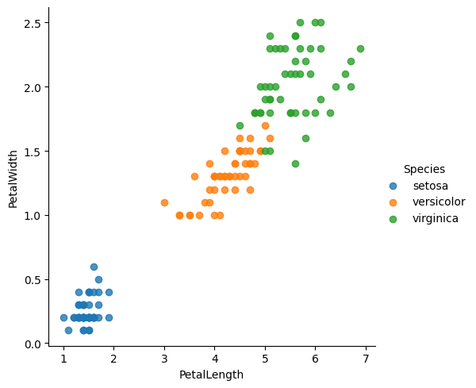

# Iris Species Classification

This data set contains data for three species of Iris flower: setosa, versicolor, and virginica. Each entry contains the petal length and width and sepal length and width of the flower along with the flower's classification into one of the three species. This is a clean data set, and the data features provide a good distinction between the species. The plot below shows that the setosa species will likely be able to be predicted with high accuracy, but the overlap between the versicolor and virginica species means that there will likely be misidentifications there.

As expected, a plot of petal width vs petal length with colors for each species shows a distinct group for setosa while there is some overlap between versicolor and virginica. The nature of the overlap is such that there is not any clear dividing line that can be drawn between the groups. A highly curved arc shape can be seen visibly, but that shape would be hard to recreate accurately using a model. 

Also of note is the fact that petal length and petal width are clearly very highly correlated, so it is possible that including both variables may help us distinguish the groups visually, but it might not improve the model. 

Using the k-means algorithm which separates the groups into spheres, we can predict the species within this data set with 89% accuracy. Further refinement of the model could be potentially be achieved with more data and more extensive testing, but the improvement would likely be marginal if only the given features are considered.